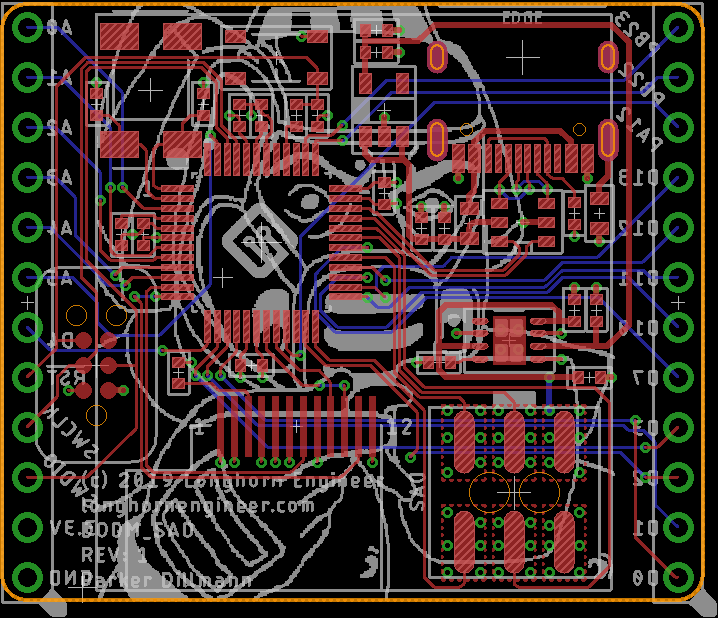
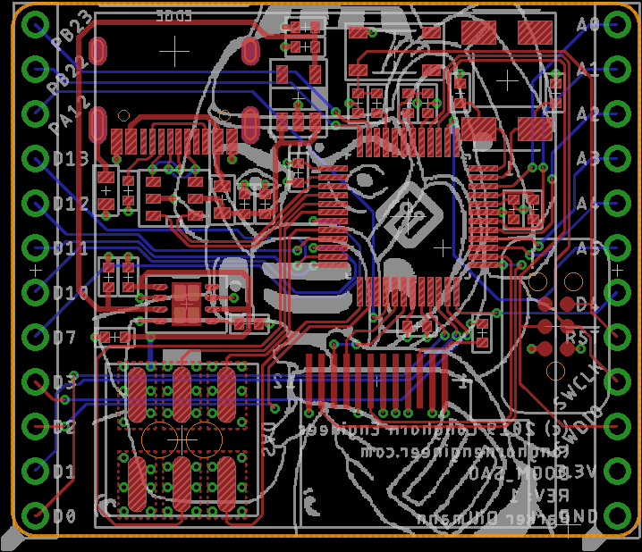
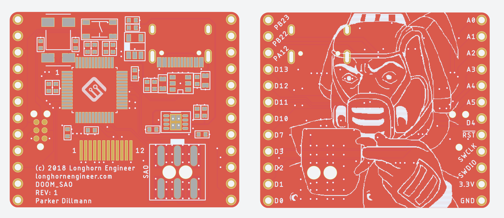

###DOOM Shitty Add On Hardware
***
**Add on for conference badges that features a LCD Screen and DOOM Guy.**

PCB was designed in AutoDesk Eagle V9.3+

##Hardware Specifications
***
*Arduino Compatible MCU ATSAMD21G18A
*Full implementation of the [V1.69bis standard](https://hackaday.com/2019/03/20/introducing-the-shitty-add-on-v1-69bis-standard/)
*High DPI ST7789 1.3" 240x240 LCD Screen
*USB Type-C configured for USB 2.0 (REVERSIBLE)
*TPS2113ADRBR Power Mux to prevent voltage back feed onto badge when USB power applied
*Tag Connect for ATMEL SWD Programming
*Unused GPIO from MCU broken out to headers
*Possibly the only 4 Layer SAO

##PCB Layers
***
1. Component mounting and signals
2. Ground
3. +3.3V
4. GPIO Breakout signals

##Schematic
***

##Board Layout
***

##PCB Render
***

***
**License Information**

This project is under the [Creative Commons Attribution-ShareAlike 4.0 International License](LICENSE.md). These files are provided with no warranty and should be used at your own risk. 

***
